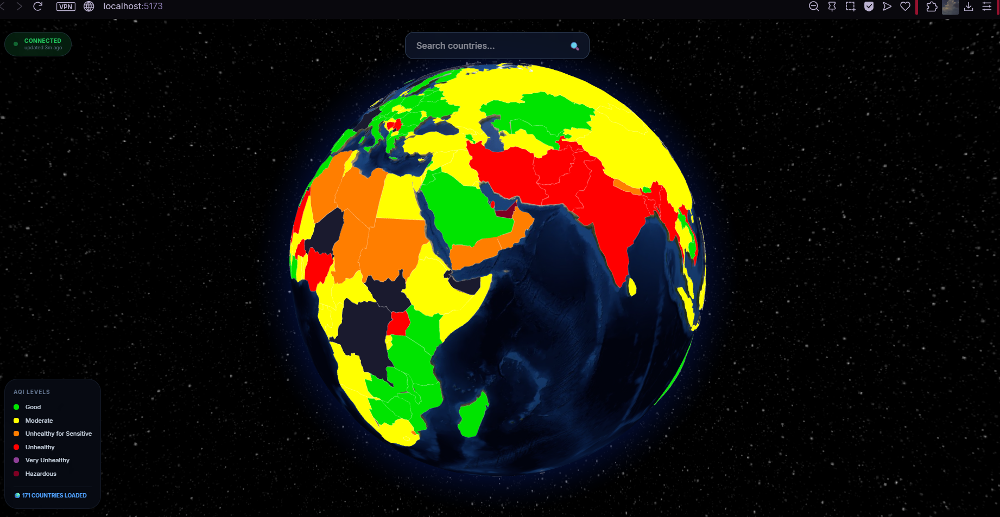
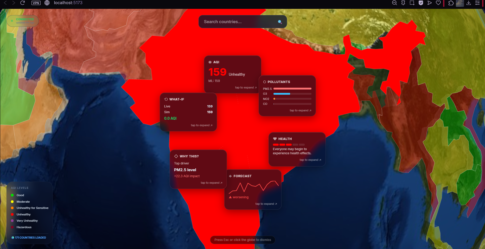

# 🌍 AirSense Globe: XAI-Powered Global Air Quality Intelligence

**AirSense Globe** is a production-grade, end-to-end Machine Learning system that predicts air quality for 173 countries in real-time. It transforms raw environmental sensor data into an immersive 3D geospatial experience, providing human-centric health guidance and policy simulation.

---

## 🚀 The Core Vision
Most AQI dashboards are static and reactive. **AirSense Globe** is proactive and transparent. It goes beyond standard ML by:
1. **Explaining Predictions:** Using industry-standard XAI (SHAP & LIME).
2. **Real-Time MLOps:** Refreshing global data every 12 hours with WebSocket streaming.
3. **Counterfactual Analysis:** Allowing users to simulate "What-If" scenarios to see the impact of policy changes.

---

## 🧠 The Machine Learning Engine

The system utilizes a dual-task ensemble architecture trained on **23,000+ global observations**.

### Ensemble Strategy: Bagging vs. Boosting
To ensure robust performance, we implement a weighted ensemble of:
* **Random Forest (Bagging):** Reduces variance and handles noisy sensor data from diverse global regions.
* **XGBoost (Boosting):** Reduces bias and accurately captures extreme pollution "spikes" in hazardous zones.

### Performance Benchmarks
| Metric | Value | Significance |
| :--- | :--- | :--- |
| **Ensemble $R^2$** | **0.997** | Explains 99.7% of global AQI variance. |
| **RF Residual Mean** | **0.00** | Zero systematic bias in predictions. |
| **RF Residual Std** | **3.14** | 99% of predictions are within ±6 AQI units. |
| **Classification Accuracy** | **99.9%** | Perfect categorization across 6 EPA classes. |

---

## 🔬 Novel Feature Engineering
We engineered **18 features**, including original research-grade indicators:
* **Pollutant Complexity Index (PCI):** The $\sigma$ of all four pollutants. High PCI = Broad-spectrum smog; Low PCI = Single-source toxicity.
* **Dominance Ratio (DR):** The fraction of total AQI held by the worst pollutant (e.g., is PM₂.₅ driving 90% of the risk?).
* **Chemical Interaction Terms:** Cross-products like $CO \times NO_2$ to capture photochemical relationships.
* **Geo-Clustering:** K-Means clustering ($k=6$) to provide spatial priors based on regional industrial profiles.

---

## 🔍 XAI: Explainable AI Framework
We move beyond "Black Box" AI by integrating a dual-layer explainability framework:
* **SHAP (Global):** Uses game theory to rank feature importance across the entire global dataset.
* **LIME (Local):** Provides granular explanations for specific, hard-to-predict cities, showing exactly which pollutant pushed the AQI into a specific category.

---

## 🛰️ Production MLOps & Architecture
The system is built on a production-style stack designed for 24/7 reliability.

### 12-Hour Autonomic Refresh
The backend (FastAPI + Redis + APScheduler) follows a strict data-lifecycle:
1.  **Ingestion:** Fetches fresh signals from the **WAQI API**.
2.  **Inference:** Processes data through the RF + XGB ensemble.
3.  **Persistence:** Records snapshots in **SQLite** and caches current states in **Redis**.
4.  **Broadcast:** Pushes updates to the 3D Globe via **WebSockets** every 12 hours (with a 15-minute priority cycle for high-pollution hotspots).

### Tech Stack
* **Frontend:** React, Vite, Three.js (React-Globe.gl), Tailwind CSS.
* **Backend:** FastAPI, Redis, SQLite, APScheduler.
* **ML Libraries:** Scikit-Learn, XGBoost, SHAP, LIME, Prophet.

---

## 🛠️ Installation & Local Setup

### 1. Clone & Install Dependencies
```bash
git clone [https://github.com/your-username/airsense-globe.git](https://github.com/your-username/airsense-globe.git)
cd airsense-globe
pip install -r requirements.txt
WAQI_API_KEY=your_key_here
REDIS_URL=redis://localhost:6379
DB_PATH=./data/aqi_history.db
# Start the Backend
uvicorn src.api.main:app --reload --port 8000

# Start the Frontend
cd frontend && npm install && npm run dev
---
```
---

## 🖼️ Visual Intelligence Gallery

### 🌐 Global Interface
The planetary view renders 171+ countries with real-time AQI mapping. Each polygon's color is driven by our **RF + XGB Ensemble** inference engine.

<p align="center">
  
</p>

---

### 🔍 XAI & Country Deep-Dive
When a country is selected, the **Cinematic Interaction Model** activates. This view integrates **SHAP-based feature attribution** (the "Why This?" card) and the **What-If Simulator**.

<p align="center">
  
</p>

---

### 🎥 Feature Demonstrations
Explore the platform's core capabilities through these targeted walkthroughs.

| 🛰️ Global UI & Navigation | 📊 Model Explainability (XAI) | 🧪 "What-If" Policy Simulator |
| :---: | :---: | :---: |
| [](assets/screen_recording1.mp4) | [](assets/screen_recording2.mp4) | [](assets/screen_recording3.mp4) |
| *Real-time planetary sync* | *SHAP & LIME attribution* | *Counterfactual analysis* |

> **Pro-Tip:** If you are viewing this on GitHub, you can click the badges above to open the MP4 recordings directly in your browser.

---
